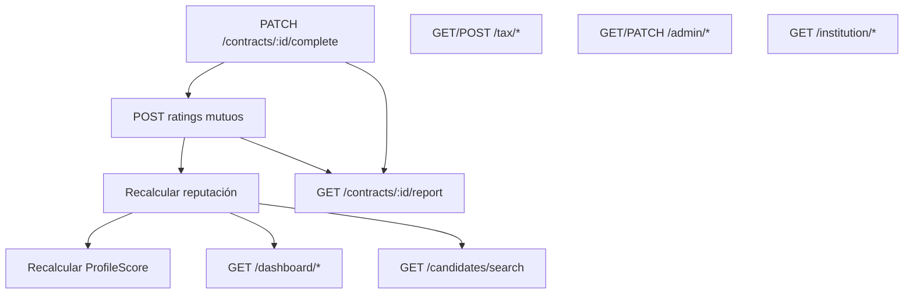
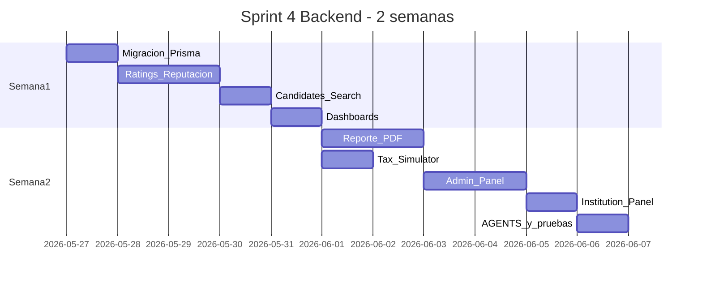

# Plan Backend Sprint 4 — TalentBridge

## Estado actual vs documento del proyecto

### Sprint 3 — backend (cerrado en ~95%)

| Historia (PDF) | Estado backend | Notas |
|---|---|---|
| HU-21/22 Notificaciones WhatsApp/n8n | Parcial | Webhook en `job.service` + `GET /notifications/jobs/:id/candidates` operativo; canal actual es **Telegram**, no WhatsApp |
| HU-23 Contratos/acuerdos | Hecho | [`contract.service.ts`](backend/src/services/contract.service.ts) + Zod |
| HU-24 Entregables candidato | Hecho | [`deliverable.service.ts`](backend/src/services/deliverable.service.ts) |
| HU-25 Revisión entregables | Hecho | `PATCH /contracts/deliverables/:id/review` |
| HU-26 Pagos + comprobante | Hecho | `POST /contracts/:id/payments`, `POST /contracts/payments/:id/receipt` |
| HU-27 Cierre de proyecto | Hecho | `PATCH /contracts/:id/complete` — valida entregables + pagos |

**Deuda Sprint 3 pendiente (no bloquea Sprint 4, pero conviene cerrar en paralelo):**
- Secret compartido en [`notification.routes.ts`](backend/src/routes/notification.routes.ts) (`N8N_WEBHOOK_SECRET`)
- Endurecer `POST /telegram/register`

### Sprint 4 — backend (0% implementado)

El schema actual en [`schema.prisma`](backend/prisma/schema.prisma) **no tiene**: modelos de calificación, reputación de empresa, pesos globales configurables, perfil de institución, ni endpoints de dashboard/admin/institution/reportes.

La reputación en el motor de ranking está **stubbed** — devuelve 50 neutro hasta Sprint 4:

```132:136:backend/src/lib/ranking.ts
function scoreReputation(reputationScore?: number): number {
  // Neutro para candidatos nuevos — se activa en Sprint 4
  if (!reputationScore || reputationScore === 0) return 50;
  return Math.round(((reputationScore - 1) / 4) * 100);
}
```

El frontend **no se tocará**, pero ya documenta endpoints que Oscar consumirá después en [`frontend/AGENTS.md`](frontend/AGENTS.md): `GET /candidates/search`, calificaciones, dashboards enriquecidos, admin, reportes PDF.

---

## Alcance Sprint 4 por módulo (historias del PDF)



| HU | RF | Módulo backend |
|---|---|---|
| HU-28/29/30 | RF-23, RF-24 | Calificaciones + reputación |
| HU-31/32 | RF-26, RF-27 | Dashboards agregados |
| HU-33 | RF-25 | Reporte PDF de contrato |
| HU-34 | RF-30 | Info tributaria + simulador |
| HU-35 | RF-28 | Panel institución |
| HU-10/14/36 | RF-29, RF-28 | Panel admin + pesos globales |
| (frontend) | — | `GET /candidates/search` paginado (Opción A acordada) |

---

## Fase 1 — Migración Prisma (base de todo)

Nueva migración `sprint4_ratings_dashboards_admin` en [`schema.prisma`](backend/prisma/schema.prisma):

**1. `ContractRating`** — calificación mutua por contrato completado
- `@@unique([contractId, raterRole])` — una calificación por parte (`COMPANY` | `CANDIDATE`)
- Dimensiones según RF-23 (enteros 1–5):
  - Empresa califica candidato: `quality`, `deadlines`, `communication`, `attitude`
  - Candidato califica empresa: `paymentPunctuality`, `instructionClarity`, `workEnvironment`
- `overallScore` (promedio de dimensiones), `comment` opcional
- Relación `contract Contract @relation`

**2. Campos en modelos existentes**
- `Contract.completedAt DateTime?` — setear en `completeContract` (necesario para reporte duración real vs estimada)
- `CompanyProfile.reputationAvg Float @default(0)` + `ratingCount Int @default(0)`
- Candidato ya tiene `ProfileScore.reputationScore` — reutilizar como promedio 1–5 de calificaciones recibidas

**3. `GlobalRankConfig`** — singleton (id fijo o `@@map("global_rank_config")` con una fila)
- Mismos campos que `JobRankConfig` (skills, experience, education, certs, reputation, languages, completion)
- Seed con valores actuales de [`DEFAULT_WEIGHTS`](backend/src/lib/ranking.ts)

**4. `InstitutionProfile`** — 1:1 con `User` rol `INSTITUTION`
- `institutionName`, `contactEmail`, `contactPhone`, `isActive`
- Métricas se calculan filtrando `CandidateProfile.institution` por nombre (MVP acordado con el documento)

---

## Fase 2 — Calificaciones y reputación (HU-28, HU-29, HU-30)

**Archivos nuevos** (patrón AGENTS.md):
- `src/services/rating.service.ts`
- `src/controllers/rating.controller.ts`
- `src/routes/rating.routes.ts` (montar bajo `/api/contracts/:id/ratings` o router dedicado `/api/ratings`)
- `lib/reputation.ts` — `recalculateCandidateReputation(candidateId)`, `recalculateCompanyReputation(companyId)`
- `lib/validators/rating.validators.ts` — Zod (scores 1–5, comment max length)
- `lib/errors/error-maps/rating.errors.ts`

**Endpoints propuestos:**

| Método | Ruta | Rol | Reglas |
|---|---|---|---|
| GET | `/contracts/:id/ratings` | partes del contrato | Estado del contrato + ratings existentes + flags `canRateCompany` / `canRateCandidate` |
| POST | `/contracts/:id/ratings/company` | COMPANY | Solo si `status === COMPLETED`, una vez |
| POST | `/contracts/:id/ratings/candidate` | STUDENT, GRADUATE | Solo si `status === COMPLETED`, candidato del contrato, una vez |

**Flujo post-calificación:**
1. Guardar `ContractRating`
2. Recalcular promedio ponderado (RF-24) en `CompanyProfile.reputationAvg` / `ProfileScore.reputationScore`
3. Llamar `ranking.service.recalculateScore(candidateId)` para que el motor use reputación real
4. Opcional: incluir `ratingsPending: boolean` en respuesta de `completeContract`

**Cambios en código existente:**
- [`contract.service.ts`](backend/src/services/contract.service.ts) → set `completedAt` al completar
- [`ranking.service.ts`](backend/src/services/ranking.service.ts) → leer pesos de `GlobalRankConfig` (fallback a `DEFAULT_WEIGHTS`)
- [`lib/ranking.ts`](backend/src/lib/ranking.ts) → activar `scoreReputation` con datos reales (mantener 50 neutro solo si `ratingCount === 0`)

---

## Fase 3 — Búsqueda de candidatos paginada (Opción A)

**Archivos:** `candidate.service.ts`, `candidate.controller.ts`, `candidate.routes.ts`

**Endpoint:** `GET /api/candidates/search`

**Query params:**
- `skills` (coma), `career`, `workMode`, `minScore`, `search` (nombre/resumen)
- `page` (default 1), `limit` (default 20, max 50)

**Respuesta:**
```json
{
  "candidates": [{ "id", "fullName", "career", "skills", "workMode", "photoUrl", "profileScore": { "totalScore", "reputationScore" } }],
  "pagination": { "total", "page", "limit", "totalPages" }
}
```

**Optimización de rendimiento (RNF-07):**
- `select` mínimo en Prisma — no incluir JSON pesado (`projects`, `certifications`) ni `cvUrl`
- Índices en migración: `CandidateProfile(career)`, GIN opcional en `skills[]` si el volumen lo justifica
- Filtro `User.isActive = true` + perfil con `cvUrl` not null (candidatos “postulables”)
- Paginación obligatoria con `skip/take` + `count` en paralelo (`Promise.all`)
- Rol: solo `COMPANY`

---

## Fase 4 — Dashboards agregados (HU-31, HU-32)

Evitar N+1 del frontend actual ([`company/page.tsx`](frontend/app/dashboard/company/page.tsx) llama applicants por cada vacante).

**Endpoints:**

| Método | Ruta | Rol | Métricas clave |
|---|---|---|---|
| GET | `/dashboard/company` | COMPANY | vacantes activas, total postulantes, contratos activos/completados, costo acumulado (`SUM payments CONFIRMED`), calificación promedio contratados, top 3 candidatos |
| GET | `/dashboard/candidate` | STUDENT, GRADUATE | score + breakdown + suggestions, postulaciones activas/históricas count, contratos activos, **ingresos** (`SUM payments CONFIRMED` de sus contratos), calificación promedio recibida |

**Archivos:** `dashboard.service.ts`, `dashboard.controller.ts`, `dashboard.routes.ts`

Usar agregaciones Prisma (`aggregate`, `_count`, `groupBy`) en una sola query por métrica — objetivo sub-800ms.

---

## Fase 5 — Reporte PDF (HU-33, RF-25)

**Dependencia nueva:** `pdfkit` + `@types/pdfkit` (no existe generador PDF hoy; solo `pdf-parse` para lectura).

**Endpoint:** `GET /api/contracts/:id/report`
- Rol: `COMPANY` (owner del contrato)
- Solo contratos `COMPLETED`
- `Content-Type: application/pdf`, `Content-Disposition: attachment`

**Contenido del PDF:**
- Costo total vs pagado
- Duración estimada (`startDate`–`endDate`) vs real (`completedAt`)
- Calificación promedio del entregable (desde `ContractRating` empresa→candidato)
- Comparativa de mercado simplificada (heurística por `job.area` + `totalAmount` — sin integración externa)
- Recomendación textual (continuar por proyecto vs vincular fijo)

**Alternativa:** subir PDF a bucket `contracts` como `report_{contractId}.pdf` si se prefiere cache; MVP puede generar on-the-fly.

---

## Fase 6 — Simulador tributario (HU-34, RF-30)

Módulo **standalone** sin migración — lógica pura en `lib/tax-benefits.ts`.

| Método | Ruta | Rol |
|---|---|---|
| GET | `/tax/benefits` | COMPANY | Texto estático Art. 108-5 ET, Ley 2466/2025, Art. 114-1 ET |
| POST | `/tax/simulate` | COMPANY | Body `{ monthlySalary: number, hireAge?: number }` → `{ estimatedAnnualSaving, breakdown, disclaimer }` |

Fórmulas documentadas en comentarios del service (aproximación educativa, no asesoría legal).

---

## Fase 7 — Panel ADMIN (HU-10, HU-14, HU-36)

**Archivos:** `admin.service.ts`, `admin.controller.ts`, `admin.routes.ts` bajo `/api/admin`

| Método | Ruta | Función |
|---|---|---|
| GET | `/admin/metrics` | usuarios activos, vacantes publicadas, postulaciones, contratos cerrados, calificación promedio global |
| GET | `/admin/users` | listado paginado con filtros `role`, `isActive`, `search` |
| PATCH | `/admin/users/:id/status` | `{ isActive: boolean }` — aprobar/suspender |
| DELETE | `/admin/users/:id` | soft-delete vía `isActive: false` o hard delete según política del equipo |
| GET | `/admin/jobs` | vacantes para moderación |
| PATCH | `/admin/jobs/:id/moderate` | `{ status: CANCELLED }` o flag |
| GET | `/admin/ranking-weights` | leer `GlobalRankConfig` |
| PUT | `/admin/ranking-weights` | actualizar pesos (validar suma ≈ 1.0, mismo patrón que [`job.service.ts`](backend/src/services/job.service.ts)) |
| GET/POST/PATCH | `/admin/institutions` | CRUD instituciones educativas |

**Seguridad:** restringir registro público de roles `ADMIN` e `INSTITUTION` en [`auth.service.ts`](backend/src/services/auth.service.ts) — solo `STUDENT`, `GRADUATE`, `COMPANY` en `/auth/register`; admin crea cuentas institución/admin.

---

## Fase 8 — Panel INSTITUTION (HU-35, RF-28)

| Método | Ruta | Rol |
|---|---|---|
| GET | `/institution/dashboard` | INSTITUTION |

**Métricas** (filtrar `CandidateProfile.institution = institutionProfile.institutionName`):
- Estudiantes/egresados activos (`User.isActive`)
- Tasa de inserción: egresados con ≥1 contrato `COMPLETED` / total egresados activos
- Top skills demandadas: `groupBy` sobre `Job.skills` de vacantes activas de la región
- Distribución contrataciones por `Job.area`

---

## Orden de implementación recomendado



**Prioridad crítica:** Fases 1–2 (calificaciones) desbloquean reputación real, reportes y dashboards completos.

**Prioridad alta:** Fase 3 (búsqueda paginada — requisito explícito del equipo).

**Prioridad media:** Dashboards, PDF, tax.

**Prioridad media-baja:** Admin + Institution (roles aún sin flujo de registro en frontend, pero requeridos por el PDF para sustentación).

---

## Convenciones obligatorias (backend/AGENTS.md)

- Capas: `routes → controllers → services → lib` — sin Prisma en controllers
- Errores: códigos `UPPER_SNAKE_CASE` + error-maps + `asyncHandler`
- Validación Zod en todos los bodies nuevos
- Prisma **6.5.0** — no migrar a v7
- Perfiles siempre `upsert` si se agrega perfil institución
- Actualizar [`backend/AGENTS.md`](backend/AGENTS.md) al cerrar cada módulo (Endpoints, Estado por sprint, Mapa de archivos)
- Registrar rutas en [`app.ts`](backend/src/app.ts) — no inline

---

## Verificación manual sugerida (sin tocar frontend)

1. Completar contrato → verificar `completedAt` y flags de calificación pendiente
2. Enviar ratings mutuos → verificar `ProfileScore.reputationScore` y `CompanyProfile.reputationAvg` actualizados
3. `POST /ranking/recalculate` → breakdown con reputación distinta de neutro
4. `GET /candidates/search?page=1&limit=20&skills=react` → paginación correcta, tiempos < 800ms
5. `GET /dashboard/company` y `/dashboard/candidate` → métricas coherentes con BD
6. `GET /contracts/:id/report` → PDF descargable
7. `POST /tax/simulate` → respuesta con ahorro estimado
8. Endpoints `/admin/*` y `/institution/*` → 403 para roles no autorizados
